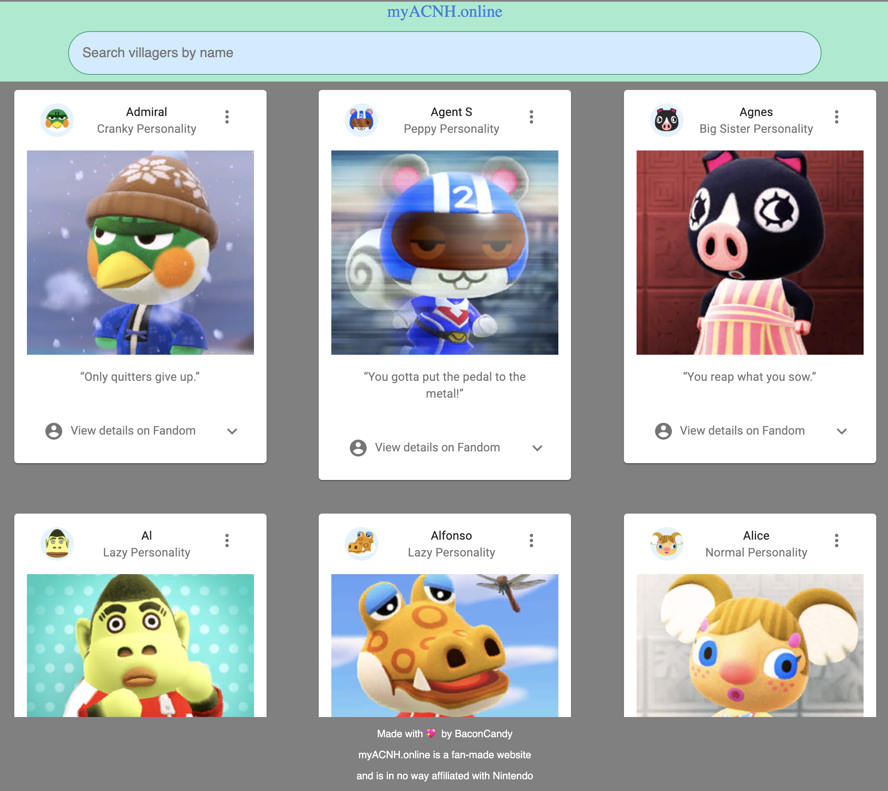

[](https://app.netlify.com/sites/myacnh/deploys)



---

### Table of Contents

- [Description](#description)
- [How To Use](#how-to-use)
- [References](#references)
- [License](#license)
- [Author Info](#author-info)

---

## Description

Creating a React web application that enables user to search the corresponding ACNH villagers from the provided keywords from Seach Box.

This repository explores the React boilerplate, pure function and class components, ECMAScript 6 (ES6) and fetch API while utilizing the fundamental React concepts on state, props, onChange, and component lifecycle.

#### Technologies

- ReactJS

[Back To The Top](#read-me-template)

---

## Contribution

We are always looking for eager developer to implement new features and smash bugs for our web application. Please reach out to repo admin at contact@seintun.dev

#### Installation

```
    $ npm install
    $ npm start
```

#### API Reference

[Data Spreadsheet for Animal Crossing New Horizons](https://docs.google.com/spreadsheets/d/13d_LAJPlxMa_DubPTuirkIV4DERBMXbrWQsmSh8ReK4)

[Back To The Top](#read-me-template)

---

## References

[Back To The Top](#read-me-template)

---

## License

myACNH.online is a fan-made website and is in no way affiliated with Nintendo

MIT License

Copyright (c) [2020][sein tun]

Permission is hereby granted, free of charge, to any person obtaining a copy
of this software and associated documentation files (the "Software"), to deal
in the Software without restriction, including without limitation the rights
to use, copy, modify, merge, publish, distribute, sublicense, and/or sell
copies of the Software, and to permit persons to whom the Software is
furnished to do so, subject to the following conditions:

The above copyright notice and this permission notice shall be included in all
copies or substantial portions of the Software.

THE SOFTWARE IS PROVIDED "AS IS", WITHOUT WARRANTY OF ANY KIND, EXPRESS OR
IMPLIED, INCLUDING BUT NOT LIMITED TO THE WARRANTIES OF MERCHANTABILITY,
FITNESS FOR A PARTICULAR PURPOSE AND NONINFRINGEMENT. IN NO EVENT SHALL THE
AUTHORS OR COPYRIGHT HOLDERS BE LIABLE FOR ANY CLAIM, DAMAGES OR OTHER
LIABILITY, WHETHER IN AN ACTION OF CONTRACT, TORT OR OTHERWISE, ARISING FROM,
OUT OF OR IN CONNECTION WITH THE SOFTWARE OR THE USE OR OTHER DEALINGS IN THE
SOFTWARE.

[Back To The Top](#read-me-template)

---

## Author Info

- LinkedIn - [Sein Tun](https://www.linkedin.com/in/seintun/)

[Back To The Top](#read-me-template)
